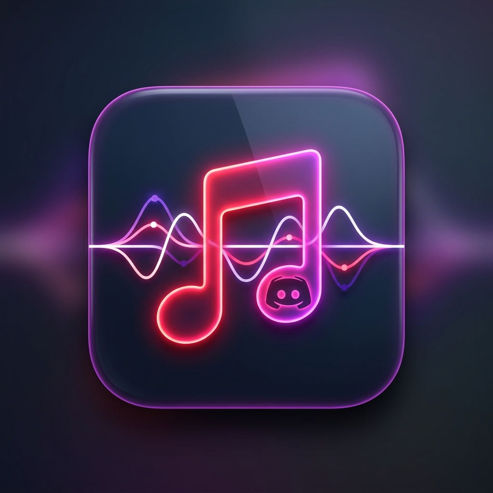
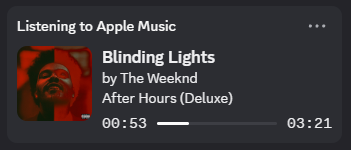
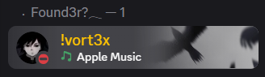
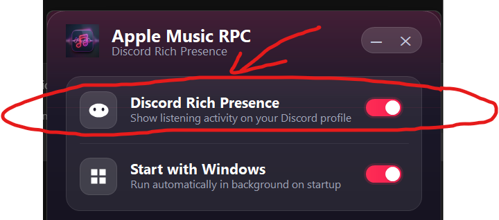
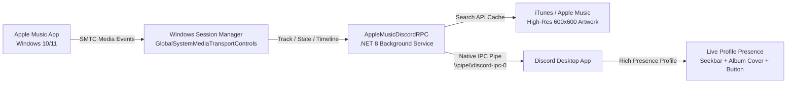

<div align="center">

  

  # Apple Music Discord Rich Presence (RPC)

  **A lightweight, native Windows background app that brings Spotify-identical Discord Rich Presence to Apple Music.**

  [](https://microsoft.com)
  [](https://dotnet.microsoft.com/)
  [](https://discord.com)
  [](#performance--architecture)
  [](LICENSE)

</div>

---

## 📸 Live Discord Showcase

<div align="center">

### 1. User Profile Rich Presence Card
*Displays active song title, artist, album name, high-resolution artwork, and a live seekbar showing elapsed / remaining duration.*



<br /><br />

### 2. Server Member List & Status Badge
*Shows up automatically on your profile badge across all Discord servers and direct messages.*



<br /><br />

### 3. Glassmorphic Settings GUI
*Minimalist frosted-glass window with glowing toggle switches and system tray integration.*



</div>

---

## ✨ Features

- 🎵 **Spotify-Identical Presence**:
  - Displays **"Listening to Apple Music"** activity in user profile cards and server member lists.
  - **Live Seekbar & Duration**: Displays active playback timestamp (`00:53 ━━━━●────── 03:21`) synchronized to your local track progress.
  - **High-Definition Album Artwork**: Automatically queries and fetches up to **600×600** cover art from Apple Music.
  - **Track & Album Metadata**: Full song title, artist names, and album name with proper parsing.
  - **Interactive Button**: Direct **"Listen on Apple Music"** button on your Discord profile that opens the track or album.

- 🪟 **Modern Glassmorphic Settings GUI**:
  - Sleek frosted glass UI with smooth neon switches and rounded corners.
  - **Discord Rich Presence [ON / OFF]**: Enable or pause Discord presence anytime without closing the app.
  - **Start with Windows [ON / OFF]**: Seamlessly toggle boot startup right from the GUI without manual registry edits.
  - **Close to Tray**: Minimizes silently to the Windows notification tray so your taskbar stays clutter-free.
  - Smooth frameless window dragging and exit controls.

- ⚡ **Ultra-Low Resource Consumption**:
  - Built directly on **Windows System Media Transport Controls (SMTC)** APIs.
  - Fully event-driven: **~0.0% CPU** usage when idle or paused.
  - In-memory metadata & artwork caching to eliminate redundant network queries.
  - Connects locally to Discord via Windows Named Pipes (`\\.\pipe\discord-ipc-0`) without heavy third-party SDK bloat.

- 🖥️ **System Tray Integration**:
  - Runs silently in the background with an Apple Music tray icon.
  - Tray context menu with single-click options for settings, toggles, and quit.
  - Single-instance mutex prevents duplicate processes.

---

## 🚀 Getting Started

### Prerequisites
- **Windows 10 (Build 19041+) or Windows 11**
- **Apple Music for Windows** (preview or official release from the Microsoft Store)
- **Discord Desktop App** (running locally)
- [.NET 8.0 Desktop Runtime](https://dotnet.microsoft.com/download/dotnet/8.0) (only if running non-contained builds)

---

### Quick Launch
1. Download or clone this repository.
2. Run `Start.bat` (or open `publish\AppleMusicDiscordRPC.exe`).
3. Start playing any song on the **Apple Music** Windows app.
4. Check your Discord profile—your live presence will appear instantly!

---

### Control from Settings or System Tray
- Click the **Tray Icon** in the bottom-right taskbar (notification chevron) to reopen the settings UI at any time.
- Right-click the **Tray Icon** for quick toggles or immediate exit.
- Toggle **Start with Windows** inside the app to automatically launch Apple Music RPC whenever you turn on your PC.

---

## 🛠️ Performance & Architecture

Unlike web scrapers, browser extensions, or window-title pollers, **Apple Music Discord RPC** connects directly to the operating system's native media session:



### Why this is faster and cleaner:
1. **No Polling**: Listens to system OS events (`TimelinePropertiesChanged`, `MediaPropertiesChanged`, `PlaybackInfoChanged`).
2. **Zero Overhead**: Zero CPU spikes during playback, and zero CPU usage when music is paused.
3. **Smart Cache**: Resolves album artwork and URLs once per unique track, storing results in memory for the session.

---

## 📦 Building from Source

To compile and publish the single-file executable yourself:

```cmd
git clone https://github.com/your-username/apple-music-discord-rpc.git
cd "apple-music-discord-rpc"
Build.bat
```

Or manually using the .NET CLI:
```cmd
dotnet publish -c Release -r win-x64 --self-contained false -p:PublishSingleFile=true -o ./publish
```

The output standalone binary will be generated in `publish\AppleMusicDiscordRPC.exe`.

---

## ⚙️ Configuration & Logs

Diagnostics and error logs are stored safely in your local app data folder:
```
%LOCALAPPDATA%\AppleMusicDiscordRPC\app.log
```

To quickly view live logs in PowerShell:
```powershell
Get-Content "$env:LOCALAPPDATA\AppleMusicDiscordRPC\app.log" -Wait -Tail 20
```

---

## ❓ Troubleshooting

<details>
<summary><b>Discord is not displaying my Apple Music presence</b></summary>

1. Ensure Discord is running and you are logged into your account.
2. In Discord, navigate to **User Settings** -> **Activity Privacy** and make sure **"Display current activity as a status message"** is turned **ON**.
3. Verify that Apple Music is currently playing (the presence clears automatically when playback stops or is paused).
4. Check `%LOCALAPPDATA%\AppleMusicDiscordRPC\app.log` for any IPC connection messages.
</details>

<details>
<summary><b>Album artwork is missing for some songs</b></summary>

Apple Music Discord RPC looks up songs in the iTunes / Apple Music catalog by title and artist. If you are playing an imported custom local audio file or an unreleased track not listed in the global Apple Music store, the app gracefully falls back to the high-res Apple Music default emblem.
</details>

<details>
<summary><b>How do I enable / disable launch on Windows boot?</b></summary>

Simply toggle the **Start with Windows** switch in the Glassmorphism settings window, or run `Install-Startup.bat` / `Uninstall-Startup.bat`.
</details>

---

## 📄 License

This project is licensed under the [MIT License](LICENSE).

---

<div align="center">
  <sub>Crafted for Apple Music listeners on Windows. Not affiliated with Apple Inc. or Discord Inc.</sub>
</div>
